# [MongoDB](https://www.mongodb.com/)

## [Download mongoDB:](https://www.mongodb.com/try/download/community)

- Search mongoDB and go to products.
- CLick Community Server and install about your p.c
- Recommend download msi version most of configuration its download automatically.

## Installation:

* ## Click on next.
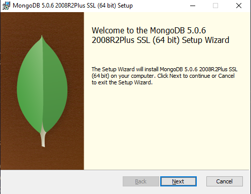

* ##  Check box i accept the terms in the licenses agreement.
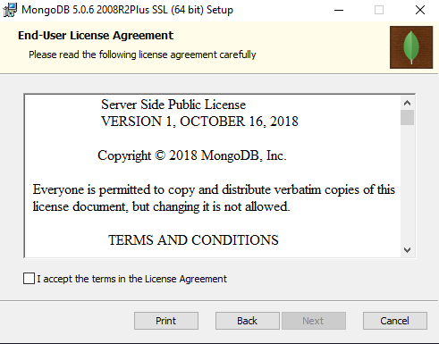

* ## Click on Complete.
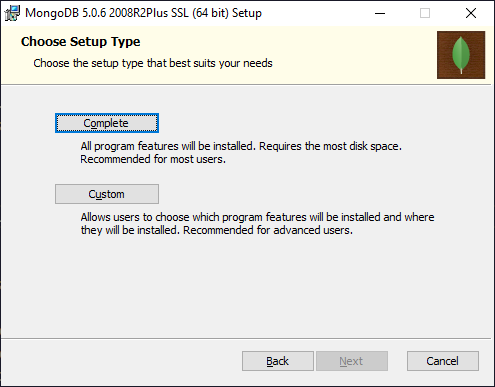

* ## Check the Install mongoDB as a Servive | Choose first option | Run service as Network Service User. if you have any solid reason to change the directory then change else set in default directory.
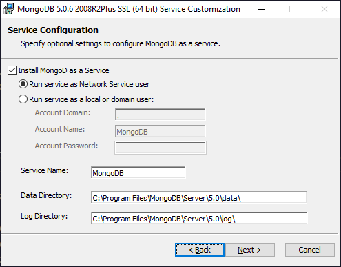

* ## In windows you can check Install mongoDB Compass.
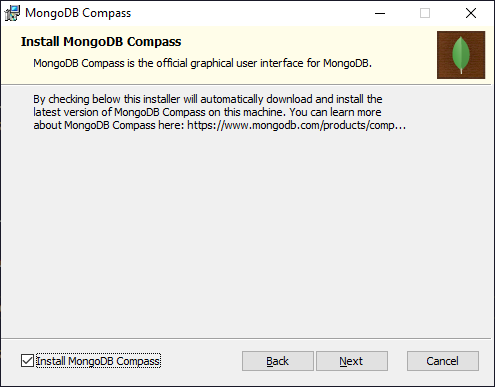

* ## Click on Install.
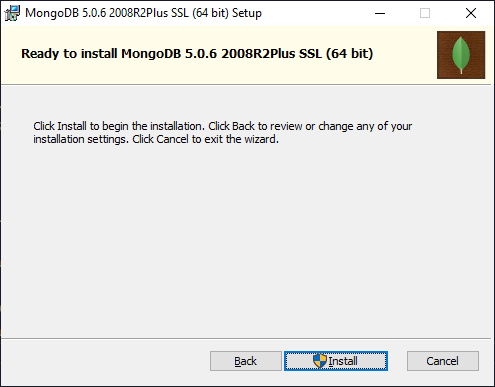

* ## Wait for Install.
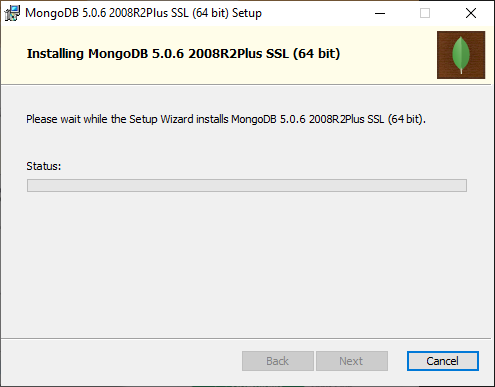

* ## Congratulations mongoDB has been Installed.
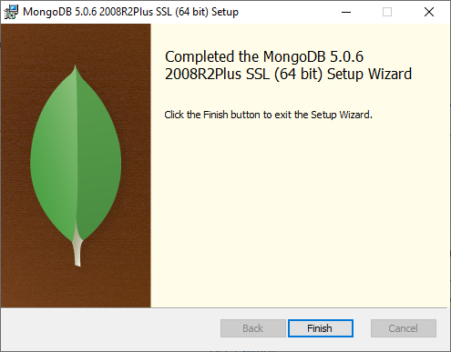

# Compass

* ## if you download windows the compass included in community server. Other p.c example Mac'Os and linux you can download seperately.
* ## Compass is a tool that can make you a gui. GUI means is Graphical user Interface.
* ## Compass is a good representive tool that can show a all database data you can also perform query & you can change data.
* ## Time of Installation mongoDB ask you to download compass if you check then download compass automatically.

### How Compass looks like?

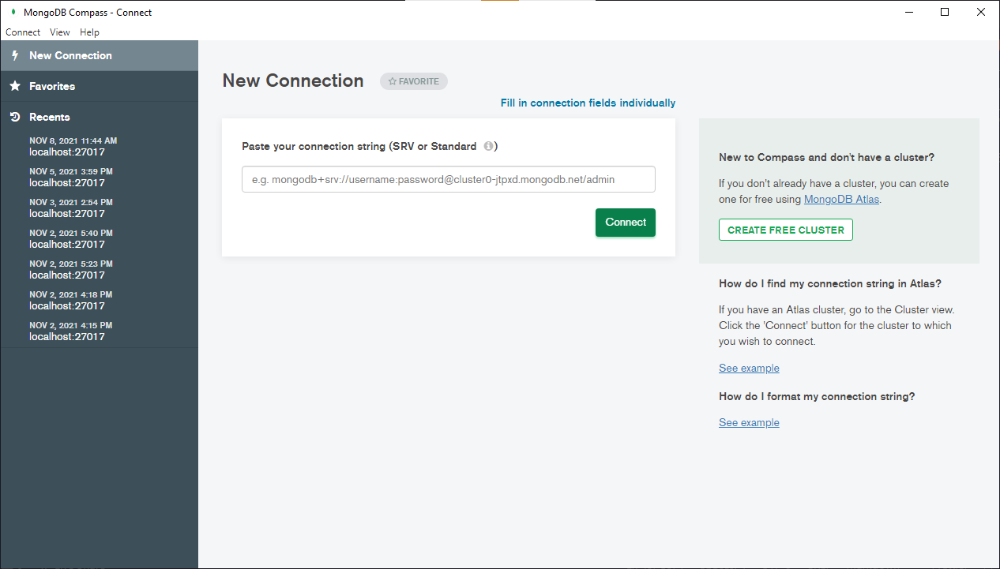

# [Download MongoDB Shell](https://www.mongodb.com/try/download/shell)

* ## Click on Next.

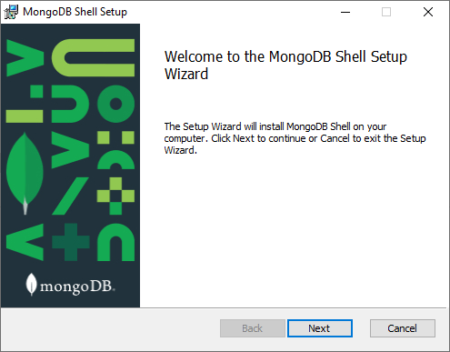

* ## if you have any solid reason to change the directory then change else set in default directory and Click on Next. 

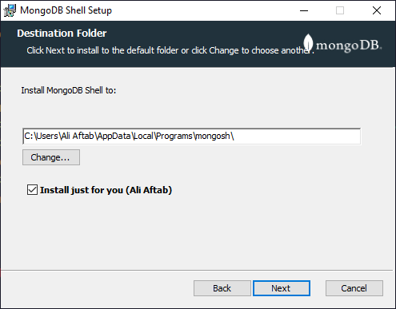

* ##  Click to Install.

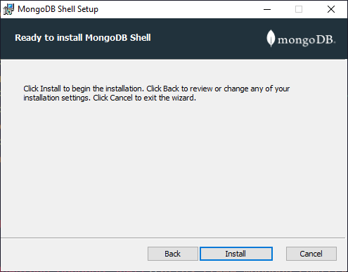

* ##  Congratulations mongoDB Shell is ready to use.

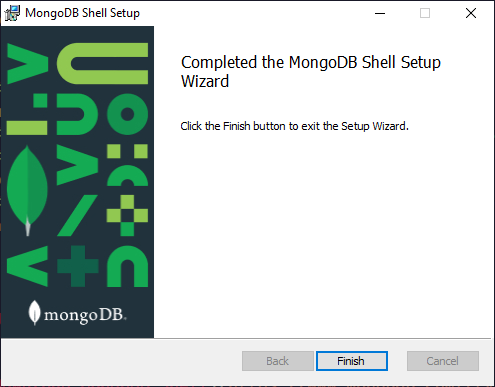

# Basic Shell Commands

* ## Show dbs

### Show dbs shows 3 default databases.
   
     admin
     config
     local

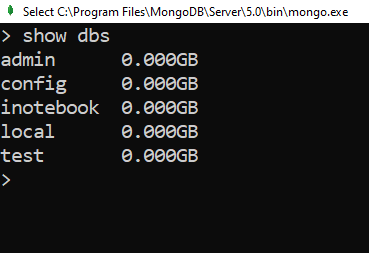

* ## Create new Database

### Use shop create a new database shop is a database name you can place any word after use.

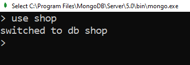

# MongoDB Crud

* ## Insert Data in Collection

        db.collectionName.insertOne({Hello : "World"})

        db.collectionName.insertMany([{name : "a"}, {name : "b"}])

* ## Find Data in Collection

          db.collectionName.findOne({Hello : "World"})

          db.collectionName.find([{name : "a"}, {name : "b"}])

* ## Updata Data in Collection
           
        db.collectionName.updateOne({Hello : "World"}, {$set : {HelloWorld : true}})

        db.collectionName.updateMany({Hello : "World"}, {$set : {HelloWorld : true}})

* ## Delete Data in Collection
           
        db.collectionName.deleteOne({Hello : "World"}, {$set : {HelloWorld : true}})

        db.collectionName.deleteMany({Hello : "World"}, {$set : {HelloWorld : true}})

